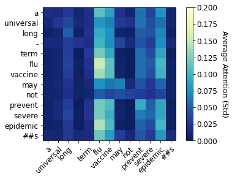
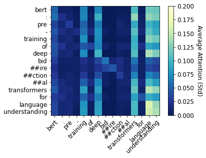
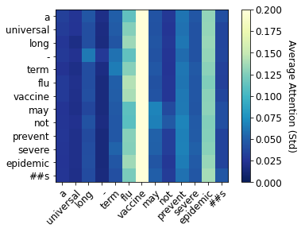
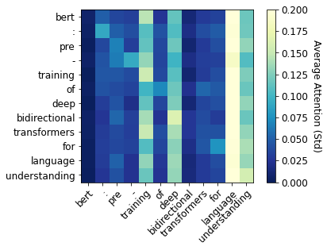
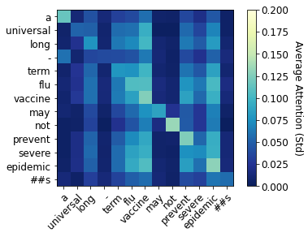
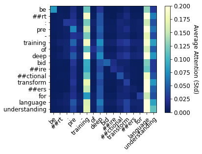

# Is BERT self-attention a feature selection method? A case study in classification of scholarly communications
This repository includes full-size images, tables and jupyter notebooks with the experiments reported in the paper **Is BERT self-attention a feature selection method? A case study in classification of scholarly communications** submitted for revision to **ECIR 2021**. The following subjects presented in the paper are covered here:

* [Fine-tuning Language Models for Text Classification](#fine-tuning-language-models-for-text-classification)
  + [Experimental results](#experimental-results)
* [Exploring self-attention heads](#exploring-self-attention-heads)
* [Feature Selection](#feature-selection)
  + [Domain knowledge](#domain-knowledge)
  + [Feature evaluation](#feature-evaluation)

## Fine-tuning language models for Text Classification

   
  Language models pre-training information.

### Experimental results

   
  Evaluation results of the multilabel classifiers (f-measure) on first level categories (a), and on second level categories (b).

## Exploring self-attention heads
 
| 
<b>BERT</b>
  | 
<b>BERT</b>
 |
|:---:|:---:|
| 
<b>SciBERT</b>
 | 
<b>SciBERT</b>
 |
| 
<b>BioBERT-1.1</b>
 | 
<b>BioBERT-1.1</b>
 |

Visualization  of  average  weights  in  the  self  attention  heads  of  the  last layer.

   
  Most attended words above average attention in the fine-tuned models.

## Feature Selection

   
  Word overlap: most attended and feature selection results. algorithm.

   
  Rank-biased overlap at different p values (X axis) between most attended words and selected by feature selection algorithm.

### Domain knowledge

   
  Number of words per ANZRSC category that match the corresponding context in ConceptNet.

### Feature evaluation

   
  Stability of the features measured using Jackard similarity coefficient.

   

